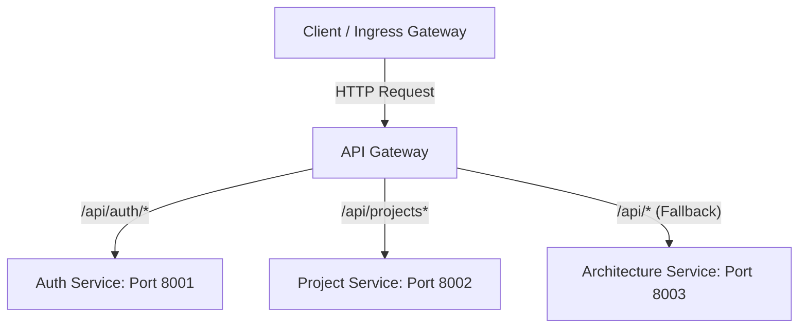

# API Gateway

The API Gateway is the central entry point and reverse proxy for the ArchGen microservices platform. Built on **FastAPI** and utilizing **httpx** for high-performance asynchronous request forwarding, the gateway routes external client traffic to downstream microservices, handles cross-origin resource sharing (CORS), appends correlation IDs for distributed tracing, and records transaction logs.

---

## 1. Architectural Role & Flow

The API Gateway intercepts all external requests under the `/api/` prefix and routes them dynamically based on the path structure:



### Key Middlewares & Behaviors:
1. **CORS Middleware** ([cors.py](file:///c:/Users/Praveen/Desktop/New%20folder/api-gateway/middleware/cors.py)): Configures access controls dynamically by loading allowed origins from environment variables (`ALLOWED_ORIGINS`) and appending the production domain (`PRODUCTION_ORIGIN`). Supports common HTTP methods (`GET`, `POST`, `PUT`, `DELETE`, `PATCH`, `OPTIONS`, `HEAD`) and headers (`Authorization`, `Content-Type`, `Accept`, `X-Correlation-Id`).
2. **Logging Middleware**: Logs incoming HTTP requests, paths, and response statuses to help with observability and debugging.
3. **Correlation ID Filter**: Extracts the `X-Correlation-Id` header from requests or injects one if missing. This ID is passed to downstream services, allowing end-to-end tracing of individual requests across all microservices.

---

## 2. Configuration & Environment Variables

The gateway configuration is managed in [config.py](file:///c:/Users/Praveen/Desktop/New%20folder/api-gateway/config.py) using `pydantic-settings`. It reads configuration parameters from a local `.env` file or direct container environment bindings:

| Variable | Type | Default | Description |
|---|---|---|---|
| `GATEWAY_PORT` | `int` | `8080` | The port the gateway server binds to inside the container. |
| `GATEWAY_REQUEST_TIMEOUT` | `int` | `300` | Gateway request timeout in seconds for downstream service calls. |
| `PRODUCTION_ORIGIN` | `str` | *Required* | The production origin allowed by CORS policy (e.g. `https://printnow.space`). |
| `AUTH_SERVICE_URL` | `AnyUrl` | *Required* | Downstream base URL for the Auth Service. |
| `PROJECT_SERVICE_URL` | `AnyUrl` | *Required* | Downstream base URL for the Project Service. |
| `ARCHITECTURE_SERVICE_URL` | `AnyUrl` | *Required* | Downstream base URL for the Architecture/AI Service. |
| `ALLOWED_ORIGINS` | `str` | `http://localhost:3000,http://localhost:5173` | Comma-separated list of allowed origins for development. |

---

## 3. Route Mapping Logic

Downstream proxy logic is defined in [router.py](file:///c:/Users/Praveen/Desktop/New%20folder/api-gateway/router.py). The gateway strips hop-by-hop headers before forwarding:

* **Auth Service Target**:
  - Request Path: `/api/auth/{remaining_path}`
  - Downstream URL: `AUTH_SERVICE_URL/auth/{remaining_path}`
  - Example: `/api/auth/login` $\rightarrow$ `http://auth-service:8001/auth/login`
* **Project Service Target**:
  - Request Path: `/api/projects` or `/api/projects/{remaining_path}`
  - Downstream URL: `PROJECT_SERVICE_URL/projects` or `PROJECT_SERVICE_URL/projects/{remaining_path}`
  - Example: `/api/projects/65c82a17...` $\rightarrow$ `http://project-service:8002/projects/65c82a17...`
* **Architecture Service Target**:
  - Request Path: `/api/{other_path}` (fallback)
  - Downstream URL: `ARCHITECTURE_SERVICE_URL/{other_path}`
  - Example: `/api/generate-architecture` $\rightarrow$ `http://architecture-service:8003/generate-architecture`

---

## 4. API Endpoints Reference

### Health check Endpoints
The gateway directly handles health checks for ingress monitoring and Kubernetes probes:

#### `GET /healthz`
- **Description**: Returns the operational status of the gateway.
- **Request Headers**: None
- **Response (200 OK)**:
  ```json
  {
    "status": "healthy"
  }
  ```

#### `GET /ready` or `GET /readyz`
- **Description**: Returns the readiness probe status of the gateway.
- **Request Headers**: None
- **Response (200 OK)**:
  ```json
  {
    "status": "ready"
  }
  ```

### Catch-All Proxy Router

#### `GET/POST/PUT/DELETE/PATCH/OPTIONS/HEAD /api/{full_path:path}`
- **Description**: Catches all requests matching the prefix `/api/` and routes them to their respective microservices.
- **Headers**:
  - `X-Correlation-Id` (Optional/Injected): Correlation identifier.
  - `Authorization: Bearer <JWT_TOKEN>` (Optional/Required downstream): Passed transparently.
- **Request Body**: Accepts any text or JSON payload and streams it to the destination.
- **Response (200 OK, 4xx, 5xx)**: Returns the status, headers, and body stream received from the downstream service.
- **Response (502 Bad Gateway)**:
  - Triggered if a connection to the downstream service cannot be established or times out.
  - Body:
    ```json
    {
      "detail": "Connection error or host unreachable details"
    }
    ```

---

## 5. OpenAPI & Interactive API Documentation

While the gateway acts as a reverse proxy, the Swagger UI of individual downstream services can be accessed:

1. **Architecture/AI Service OpenAPI**:
   - Access Path: `http://api.printnow.space/api/docs` (production) or `http://localhost:8080/api/docs` (local gateway dev).
   - This works because any path under `/api/` not matched by `auth` or `projects` routes directly to the architecture service.
2. **Auth Service OpenAPI**:
   - Accessed directly in local development environments at `http://localhost:8001/docs`.
3. **Project Service OpenAPI**:
   - Accessed directly in local development environments at `http://localhost:8002/docs`.
